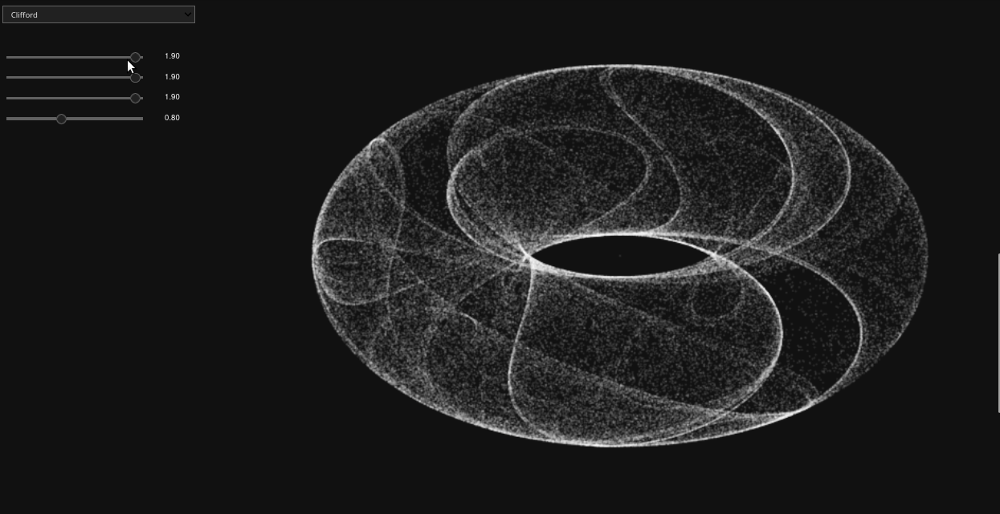

# Feeling Attracted

This is a simple attractor visualization inspired [this notebook](https://panel.holoviz.org/gallery/simple/clifford_interact.html). Right now it is made with [numpy](), [ipycanvas](), and [ipywidgets](), although it may change. It's not optimized for speed yet, despite this it already feels more reactive than the aforementioned.

## Run it

Just create a virtualenvironment and run:

`pip install jupyterlab voila ipycanvas`

or, with conda:

`conda install -c conda-forge jupyterlab voila ipycanvas`.

I've run into problems with my [ipywidgets]() version. It may be fixed soon, but if your widgets are not appearing, run:

`pip install ipywidgets==7.6.3`

or, with conda:

`conda install -c conda-forge ipywidgets==7.6.3`.

You can run the notebook without even installing [voila](), but if you want to run the notebook as a instandalone web application, run it with:

`voila --enable_nbextensions=True --theme=Dark With\ ipycanvas.ipynb`

*With ipycanvas.ipynb* is the name of the notebook for now. Sorry about this.

## Available Attractors right now:

- Clifford Attractor (fractral dream attractor)

## To do

- Everything

Updates soon.
